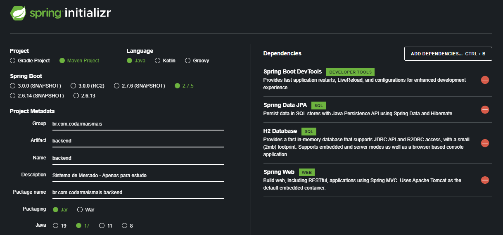

# backend

>Status: Em Desenvolvimento

Inicialização com Spring Boot:

    

### Inicialização com Docker ###

Abra o terminal no diretório do projeto e execute o comando abaixo para iniciar a imagem do projeto:

docker compose up -d

Com este comando, você inicializará uma instância do banco de dados postgres já configurada no arquivo docker-compose.yml.
que fará com que o banco de dados rode na porta 5435.

### Inicialização do projeto ###

Para inicializar o projeto, basta executar o backend application.

* Login e Senha: movimentocodar 